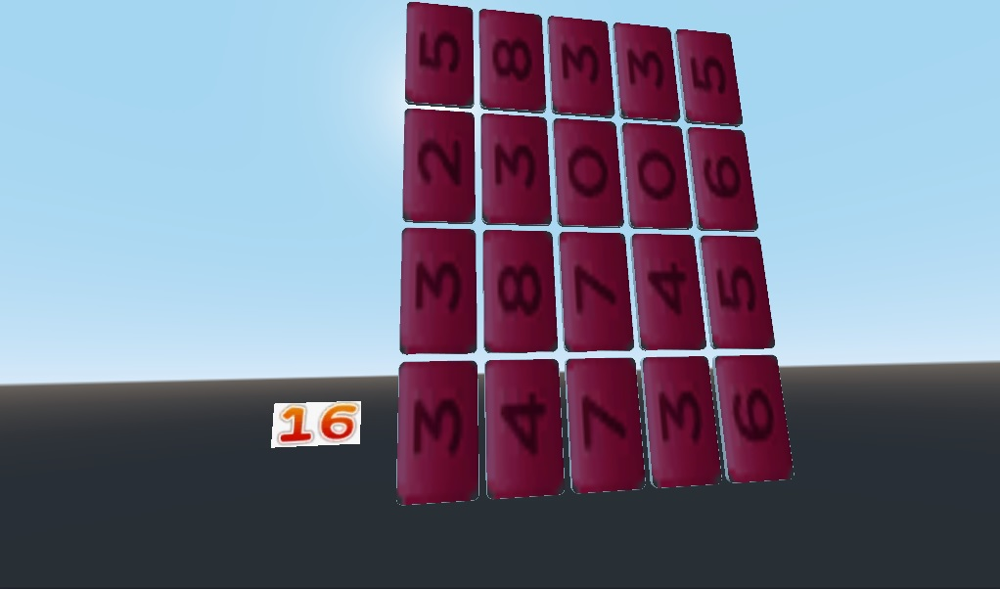

# Readme

Moteur de jeu : [Godot Engine 3.5](https://godotengine.org/) (Ne nécessite pas d'installation et pèse moins de 100Mo !)  
(Non compatible avec Godot Engine 4)

(La scéne principale est vide, tous les élèments sont ajoutés dynamiquement)

Test du moteur avec un début de jeu de "Memory".  
Les dominos sont face visible pour faciliter les tests. Ils réagissent au survol de la souris.  
Il faut cliquer sur les dominos pour les sélectionner.  
Plus la chaine de dominos de même face est grande plus le nombre de point gagné est exponentiellement grand. En cas d'erreur, plus la chaine est longue plus les points perdus sont grand.  
Dès lors qu'un dominos est retourné, la chaine se valide automatiquement après un laps de temps et une nouvelle face est attribuée aux dominos.

